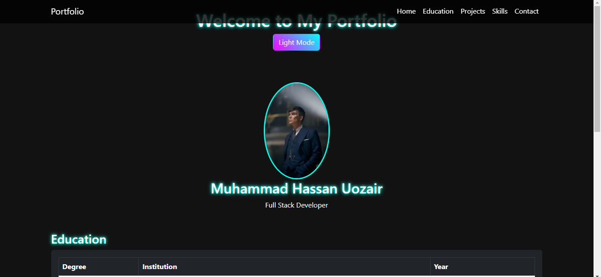
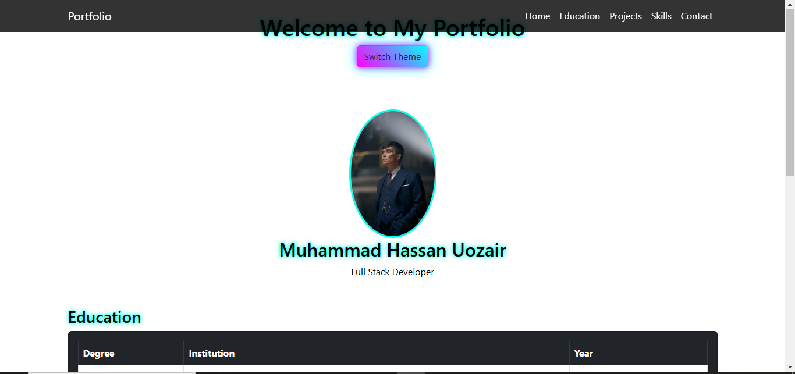

# Portfolio Website

## Description
This is a personal portfolio website showcasing my projects, skills, and education. The website is designed using HTML, CSS, JavaScript, and Bootstrap to ensure a responsive and visually appealing layout.

## Features
- Dark and Light Theme Toggle
- Navigation bar with links (Home, Education, Projects, Skills, Contact)
- Sidebar with profile details (collapses on mobile)
- Cards for projects with hover effects
- Progress bars for skill levels
- Responsive design using Bootstrap Grid/Flexbox
- Contact form with validation
- Social media links (GitHub, LinkedIn, Twitter)

## Screenshots
### Dark Mode


### Light Mode


## Live Demo
[Portfolio Website](https://hassan252927.github.io/portfolio-2025/)

## Technologies Used
- HTML5 & CSS3
- Bootstrap 5
- JavaScript
- FontAwesome & Bootstrap Icons

## How to Use
1. Click on the theme toggle button to switch between light and dark modes.
2. Navigate through different sections using the navbar.
3. Click on project cards to visit live project demos.
4. Contact through the provided form.

## Setup Instructions
1. Clone the repository:
   ```bash
   git clone https://github.com/hassan252927/portfolio-2025.git
   ```
2. Navigate to the project folder:
   ```bash
   cd portfolio-2025
   ```
3. Open `index.html` in a browser to view the website.

## License
This project is open-source and available under the MIT License.

---
### Author
**Muhammad Hassan Uozair**

